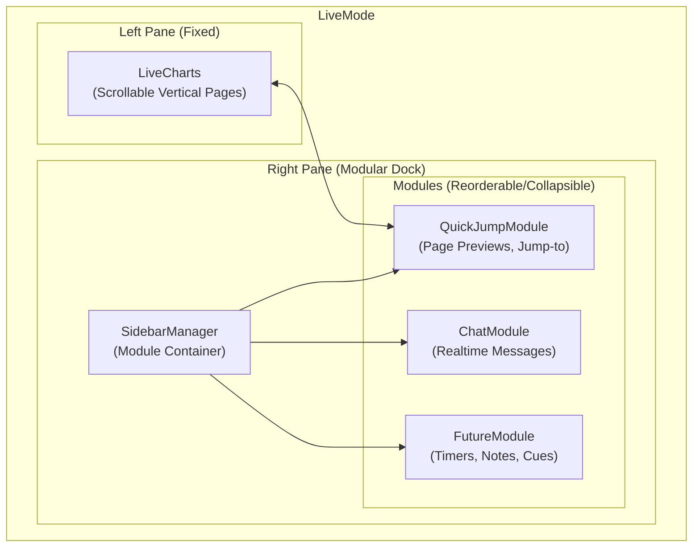
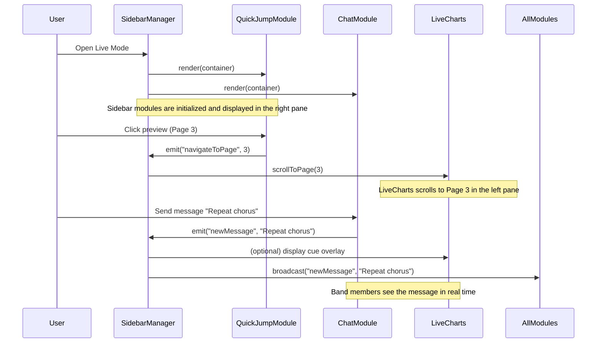

That’s a really sharp architectural refinement, Eli — you’re essentially describing a **modular layout system** where the *core live charts* remain fixed and reliable on the left (non‑negotiable for musicians), while the **right‑hand sidebar becomes a flexible dock** that can host multiple modules (Quick Jump, chat, maybe even future tools like timers or cues).

Here’s how you can structure it:

---

## 🧩 Modular Live Mode Layout

### 1. **Left Pane (Fixed)**
- **Scrollable vertical charts** (full‑page, large, sequential).
- This remains the “performance view” — no distractions, just readable music.

### 2. **Right Pane (Modular Dock)**
- A **stack of modules** that can be:
  - **Quick Jump Navigator** (page previews, reorderable, jump‑to‑page).
  - **Realtime Chat** (band leader, pastor, production team).
  - **Future modules** (e.g., setlist notes, timers, cues).
- Each module is:
  - **Resizable** (drag to change height).
  - **Collapsible** (hide/show).
  - **Reorderable** (drag‑and‑drop to move chat above Quick Jump, or vice versa).

---

## 🛠️ Implementation Strategy

### A. **Layout System**
- Use a **flexbox or CSS grid** with two main columns:
  - `left: charts`
  - `right: modules`
- Inside the right column, implement a **stack container** where modules can be reordered.

### B. **Module API**
Define a simple interface for sidebar modules:
```js
interface SidebarModule {
  id: string;
  title: string;
  render(container: HTMLElement): void;
  resize?(newSize: number): void;
  collapse?(): void;
}
```
This way, **Quick Jump** and **Chat** are just two implementations of the same contract.

### C. **Drag-and-Drop Reordering**
- Use a lightweight library (e.g., `SortableJS`) or native HTML5 drag‑and‑drop.
- Persist order in `localStorage` or session config so each user’s layout is remembered.

### D. **Realtime Chat**
- WebSocket‑based (Socket.IO or native WS).
- Messages scoped to the session code.
- UI: minimal, large readable text, quick‑send buttons for common cues (“Repeat chorus”, “Bridge next”, “Key change”).

### E. **Quick Jump Module**
- Render page previews (small canvases).
- Clicking a preview scrolls the left pane to that page.
- Supports reordering (dragging previews changes page order in the session).

---

## 🎯 Why This Works
- **Musicians**: uninterrupted, legible charts on the left.
- **Leaders**: flexible communication and navigation tools on the right.
- **Future‑proof**: you can add more sidebar modules without touching the live charts core.

---

## 🔮 Next Step
I’d suggest scaffolding a **`SidebarManager`** component that:
- Registers modules (`chat`, `quick-jump`, etc.).
- Handles drag‑drop reordering.
- Persists layout state.
- Renders modules in the right pane.

---

👉 Do you want me to draft a **component diagram** showing `LiveCharts`, `SidebarManager`, `ChatModule`, and `QuickJumpModule` so you can drop it into your planning docs? That would give you a clear visual of how these pieces interact.

Perfect — here’s a **component diagram** for the modular Live Mode you described, showing how the fixed scrollable charts interact with the flexible sidebar modules (Quick Jump, chat, etc.). You can drop this straight into your planning docs as a **Mermaid diagram**:



---

## 🔍 How to Read This
- **LiveCharts**: Always fixed on the left, vertical scroll, large readable pages.
- **SidebarManager**: A controller that manages the right-hand dock.

 **Modules**: Independent, pluggable units (Quick Jump, Chat, Future).
  - Each module implements a simple API (`render`, `resize`, `collapse`).
  - Users can reorder modules (drag-and-drop), resize them, or collapse them.
 **Interaction**:
  - Quick Jump → scrolls the left pane to the right page.
  - Chat → realtime WebSocket messages scoped to the session.
  - Future modules → can be added without changing the core.

---

## 🛠️ Next Steps
1. **Scaffold `SidebarManager`** as a container with drag‑drop ordering.
2. **Define a Module API** so each sidebar feature is pluggable.
3. **Implement Quick Jump Module** first (since it already exists conceptually).
4. **Add ChatModule** with WebSocket integration.
5. **Persist layout state** (order, size, collapsed state) in `localStorage` or session config.

---

👉 Do you want me to also sketch the **Module API contract** in code (TypeScript/JS interface) so you can enforce consistency across Quick Jump, Chat, and future modules?

Here’s a clean **Module API contract** you can drop into your docs or codebase. This gives you a consistent way to build sidebar modules (Quick Jump, Chat, future tools) so they all plug into the `SidebarManager` without special‑casing:

---

## 🛠️ Next Steps
1. **Scaffold `SidebarManager`** as a container with drag‑drop ordering.
2. **Define a Module API** so each sidebar feature is pluggable.
3. **Implement Quick Jump Module** first (since it already exists conceptually).
4. **Add ChatModule** with WebSocket integration.
5. **Persist layout state** (order, size, collapsed state) in `localStorage` or session config.

---

👉 Do you want me to also sketch the **Module API contract** in code (TypeScript/JS interface) so you can enforce consistency across Quick Jump, Chat, and future modules?

Here’s a clean **Module API contract** you can drop into your docs or codebase. This gives you a consistent way to build sidebar modules (Quick Jump, Chat, future tools) so they all plug into the `SidebarManager` without special‑casing:

---

## 📐 Sidebar Module API (TypeScript‑style)

```ts
/**
 * Base interface for all sidebar modules.
 * Each module is self-contained and pluggable.
 */
export interface SidebarModule {
  /** Unique identifier for the module */
  id: string;

  /** Display name shown in the UI */
  title: string;

  /** Called once when the module is mounted into the sidebar */
  render(container: HTMLElement): void;

  /** Optional: called when the module is resized by the user */
  resize?(newSize: number): void;

  /** Optional: collapse the module (hide its content, keep header visible) */
  collapse?(): void;

  /** Optional: expand the module after being collapsed */
  expand?(): void;

  /** Optional: cleanup when the module is removed or destroyed */
  destroy?(): void;
}
```

---

## 🧩 Example Implementations

### Quick Jump Module
```ts
const QuickJumpModule: SidebarModule = {
  id: "quick-jump",
  title: "Quick Jump",
  render(container) {
    // Render page previews here
    // Attach click handlers to scroll LiveCharts
  },
  resize(newSize) {
    // Adjust preview grid/list size
  },
  collapse() {
    // Hide previews but keep header
  }
};
```

### Chat Module
```ts
const ChatModule: SidebarModule = {
  id: "chat",
  title: "Realtime Chat",
  render(container) {
    // Render chat UI
    // Connect to WebSocket for session messages
  },
  collapse() {
    // Hide chat messages, keep header
  },
  destroy() {
    // Disconnect WebSocket
  }
};
```

---

## 🎯 SidebarManager Responsibilities
- Maintain an **array of SidebarModules** in the current order.
- Render them in the right pane.
- Handle drag‑and‑drop reordering.
- Persist layout state (order, size, collapsed state) in `localStorage` or session config.
- Provide hooks for adding/removing modules dynamically.

---

This way, your **LiveCharts** remain untouched on the left, while the right‑hand sidebar becomes a **true plugin system**. You can add Chat, Quick Jump, or any future module (like timers, setlists, or cues) without rewriting the layout logic.

---

👉 Do you want me to also sketch a **Mermaid sequence diagram** showing how `SidebarManager` loads modules and how, for example, the QuickJumpModule triggers a scroll in LiveCharts? That would illustrate the runtime interactions clearly.

Here’s a **Mermaid sequence diagram** that shows how the `SidebarManager`, `QuickJumpModule`, and `LiveCharts` interact at runtime. This illustrates the flow when a user clicks a preview and how the sidebar modules are loaded and managed:



---

## 🔍 What This Shows
- **Initialization**: `SidebarManager` loads and renders each module (Quick Jump, Chat, etc.).
- **Navigation Flow**: Clicking a preview triggers an event → `SidebarManager` → `LiveCharts` scrolls to the right page.
- **Chat Flow**: Sending a chat message emits an event → `SidebarManager` broadcasts to all modules → optional cue overlay in `LiveCharts`.

---

This diagram makes it clear that:
- `SidebarManager` is the **event hub**.
- Modules don’t talk directly to each other — they emit events through the manager.
- `LiveCharts` stays focused on rendering pages, while the sidebar handles collaboration and navigation.

---

👉 Do you want me to also sketch a **state diagram** for how Live Mode switches between *Organize* and *Concert* states, so you can capture the dual‑mode behavior in your docs?
